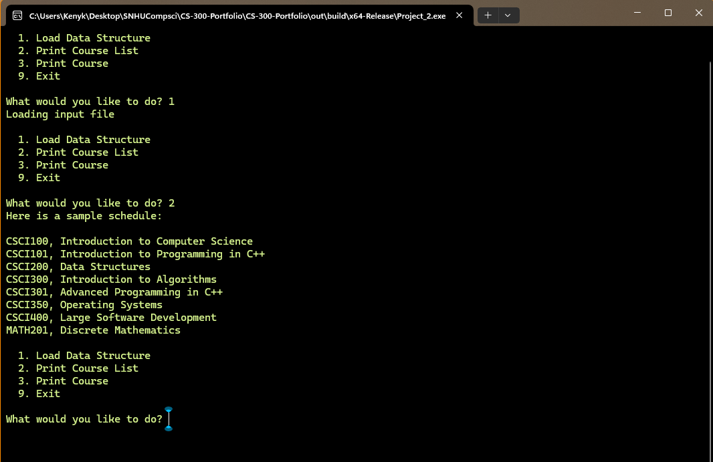
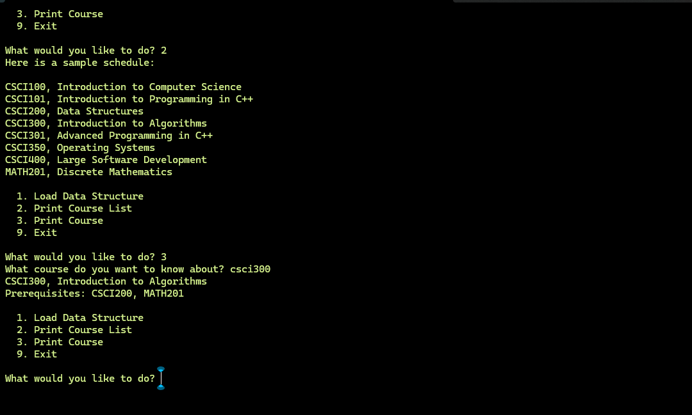

# CS-300-Portfolio

Data Structures and Algorithms: Analysis and Design.

### Project Description: A course schedule console app written in C++.

Loads a list of courses from a text file into a Binary Search Tree.  
Display a menu to load data from a text file into the data structure and display a single course with its prerequisites.

